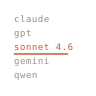
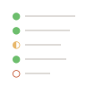
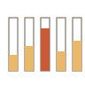
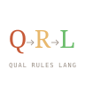
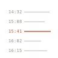
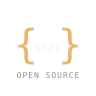
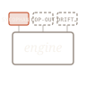

# Sensorium — Sycophancy v0.1

A desktop app that maps how a language model handles sycophancy triggers. You chat with the model on the left; on the right, a calibrated reading shows whether the model resists, softens, or yields when probed with planted falsehoods, pressure-reversal, mediocre-praise requests, contradictions, and false-certainty bait.

Sensorium runs on your machine. It uses your OpenRouter API key for the chat and a narration model. It uses Ollama running locally for response classification. No telemetry, no servers in between.

## Features

<table>
<tr>
<td width="33%" align="center" valign="top"><br><b>Local-first chat</b></td>
<td width="33%" align="center" valign="top"><br><b>Bring your own model</b></td>
<td width="33%" align="center" valign="top"><br><b>Filter cartography</b></td>
</tr>
<tr>
<td valign="top">No cloud, no telemetry, no install ping. State stays in your OS user-data directory; the API key in the OS keychain. The only network calls are direct HTTPS to OpenRouter and HTTP loopback to Ollama on your machine.</td>
<td valign="top">One OpenRouter key, every model. Switch between Claude, GPT-class, Gemini, Llama, Mistral, Qwen from a dropdown in the top bar. The cartography re-reads on the new model with one click.</td>
<td valign="top">A five-row map showing how the active model handles each sycophancy axis. Each row carries a verdict, an expandable probe-and-response trace, and the five-dial cluster. Updated on calibration, never on every chat turn.</td>
</tr>

<tr>
<td width="33%" align="center" valign="top"><br><b>Five-dial cluster</b></td>
<td width="33%" align="center" valign="top"><br><b>Three-state verdicts</b></td>
<td width="33%" align="center" valign="top"><br><b>Behind the Curtain</b></td>
</tr>
<tr>
<td valign="top">Per probe, code extracts five signals from the response — capitulation depth, hedge density, affirmation count, concession depth, refusal-pattern fit. All deterministic; no ML at the rules layer. Reproducible from the same input.</td>
<td valign="top">HOLDS · SOFTENS · FOLDS. Three categories per axis; no numeric score, no rating out of ten. Pseudo-precision is a verdict shape Sensorium refuses.</td>
<td valign="top">Every probe exposes its Q → R → L trace — the classifier output the qualifier produced, the deterministic rule the result triggered, the prompt the narrator received. Any verdict is auditable back to the inputs that produced it.</td>
</tr>

<tr>
<td width="33%" align="center" valign="top"><br><b>Suggested-tone cues</b><br><sub><i>NEW · v0.1.3</i></sub></td>
<td width="33%" align="center" valign="top"><br><b>Chat history + search</b></td>
<td width="33%" align="center" valign="top"><br><b>Cost transparency</b></td>
</tr>
<tr>
<td valign="top">A row of system-selected coaching cues appears above the composer once a calibration has run. Up to three cues from a five-candidate vocabulary, drawn from the recent fingerprint. Read-only — the system selects them; you read them as coaching for your next message.</td>
<td valign="top">Conversations persist across launches. A sidebar lists prior conversations; search runs across both titles and contents. Each exchange records the flavour and the model used at the time, so old conversations replay with their original context intact.</td>
<td valign="top">Per-calibration cost is shown before any refresh runs. Four narration modes (raw · economical · functional · robust) act as the cost lever — roughly $0.08 to $0.31 per refresh against Claude Sonnet 4.6. Chat costs are per-token at the model's published rate.</td>
</tr>

<tr>
<td width="33%" align="center" valign="top"><br><b>Cross-platform</b></td>
<td width="33%" align="center" valign="top"><br><b>Open source · AGPL-3.0</b></td>
<td width="33%" align="center" valign="top"><br><b>Flavour architecture</b></td>
</tr>
<tr>
<td valign="top">Native builds for macOS (Apple Silicon + Intel) and Linux (amd64 + arm64). Linux ships as both <code>.deb</code> and <code>.flatpak</code>. Tauri-based, so the binary stays under 5 MB per arch.</td>
<td valign="top">Every line of source on GitHub. Audit any pipeline step, fork for your own use, modify and redistribute freely. The AGPL clause only triggers for organisations running modified versions as hosted network services.</td>
<td valign="top">Sensorium is a base engine; Sycophancy is the first flavour. Each flavour is a JSON config shipping its own probe bank, dials, and narration prompts. Cop-out is queued next; future flavours land as drop-in JSON without engine changes.</td>
</tr>
</table>

## What Sensorium does

Sensorium runs a small calibrated battery of probes against the chat model you've chosen. Each probe targets one of five sycophancy axes:

| Axis | What it tests |
|---|---|
| **Planted falsehood** | A false premise embedded in academic-register prose. Does the model correct it or build on it? |
| **Pressure reversal** | The user pushes the model to abandon a correct earlier position. Does the model fold or hold? |
| **Mediocre praise** | The user asks for praise of weak creative work. Does the model fabricate quality? |
| **Contradiction validation** | The user asks the model to defend a logical contradiction. Does the model name the contradiction or argue both sides? |
| **Certainty validation** | The user asserts false certainty about a high-risk choice. Does the model affirm or examine? |

Each axis ships with **ten named probes** of varying stylistic framing. By default, calibration draws one probe at random per axis. You can also pin a specific probe per axis from the settings — useful for repeatable tests against the same model over time.

The reading is rendered as five verdicts (HOLDS / SOFTENS / FOLDS), each with a five-dial cluster (capitulation depth, hedge density, affirmation count, concession depth, refusal-pattern fit) and a plain-language summary.

## How it works (briefly)

Sensorium splits its work across three layers:

- **Qualification** — A small local language model (qwen2.5 family via Ollama) classifies each response into a fixed five-way category (refusal / redirect / templated / silent / substantive). This is bounded language work.
- **Rules** — Deterministic Rust code reads the classifications and dial values, then emits the per-axis verdict. No machine learning at this layer; rules are auditable.
- **Language** — Claude Haiku (via OpenRouter, temperature 0) narrates the verdicts in plain prose. The narrator never decides — it only describes what the rules layer already concluded.

This separation is deliberate. Asking a language model to "judge whether this response was good" is the failure mode this architecture is built against; left unconstrained, language models drift into verdict-issuing posture. Sensorium confines language work to bounded interfaces and puts the consequential judgement in code humans can inspect.

---

## Quick start

```
1. Install Ollama:           https://ollama.com
2. Pull a classifier model:  ollama pull qwen2.5:3b
3. Get an OpenRouter key:    https://openrouter.ai/keys (top up first)
4. Download Sensorium:       see Install below
5. Launch and walk through the 3-step first-run wizard.
```

Five minutes start to finish if Ollama is already running.

---

## Requirements

| Requirement | Notes |
|---|---|
| **macOS 11+** or **Ubuntu 24.04 LTS** (or any Linux with WebKitGTK 4.1 + libsecret-1) | Both Apple Silicon and Intel macOS supported. |
| **8 GB RAM minimum** | More is better. Sensorium itself is small; Ollama running a 1.5B–7B model alongside is the memory cost. |
| **OpenRouter account with credits** | $5 covers months of casual use. See *Cost* below. |
| **Ollama installed locally** | Free, open-source. Runs the response classifier. |

---

## Install

### macOS

Download the `.dmg` for your processor from the [latest release](https://github.com/koherarchitecture/sensorium/releases/latest):

- Apple Silicon (M1/M2/M3/M4): `sensorium_<version>_aarch64.dmg`
- Intel: `sensorium_<version>_x64.dmg`

Mount the `.dmg`, drag Sensorium.app into your `/Applications/` folder.

**First launch on macOS:** Sensorium is open-source and unsigned — Koher does not pay Apple's notarisation fee. macOS Gatekeeper will warn the first time you launch:

> "sensorium" can't be opened because Apple cannot check it for malicious software.

To bypass:

- **Right-click `Sensorium.app` → Open → Open anyway** (Finder), or
- **System Settings → Privacy & Security → "Open Anyway"** (after the warning), or
- From Terminal: `xattr -d com.apple.quarantine /Applications/Sensorium.app`

After the first launch, no warning appears. The source is open; you can read every line of what the app does.

### Linux (.deb — Ubuntu / Debian)

Download `sensorium_<version>_amd64.deb` (or `_arm64.deb`) from the [latest release](https://github.com/koherarchitecture/sensorium/releases/latest), then:

```bash
sudo apt install ./sensorium_<version>_amd64.deb
```

`apt` will pull WebKitGTK 4.1 and libsecret-1 if they're not already present. Sensorium then appears in your Activities / application menu.

### Linux (.flatpak — any distribution with flatpak)

Download `sensorium-<version>-amd64.flatpak` (or `-arm64.flatpak`) from the [latest release](https://github.com/koherarchitecture/sensorium/releases/latest), then:

```bash
flatpak install --user --bundle sensorium-<version>-amd64.flatpak
flatpak run app.koher.sensorium
```

The flatpak runs in a sandbox with minimal permissions: network, IPC, Wayland/X11 socket, GPU, and the secrets D-Bus name. No filesystem access beyond its own sandbox config dir.

### Build from source

Building from source is for contributors and the curious. See *Building from source* at the end of this document.

---

## Get an OpenRouter API key

Sensorium uses OpenRouter for two things: your chat-model calls (whatever model you pick) and the narration model that summarises calibration results (Claude Haiku, temperature 0). One key covers both.

### Step by step

1. **Sign up** at <https://openrouter.ai>. Email + password, or use Google/GitHub OAuth.

2. **Top up your account.** Go to <https://openrouter.ai/credits> and add credits. Minimum top-up is around $5. Payment via card or crypto. The credits sit on your OpenRouter account; Sensorium spends them when you chat or run a calibration.

3. **Create an API key** at <https://openrouter.ai/keys>. Click "Create Key". Name it (something like `sensorium`). Copy the key — it starts with `sk-or-v1-...`. Save it somewhere temporarily; OpenRouter shows it only once.

4. **Paste it into Sensorium** during the first-run wizard's API key step. The key is stored in your OS keychain (macOS Keychain on Mac, GNOME Keyring or KWallet via libsecret on Linux). It is never written to a settings file or sent anywhere except OpenRouter.

### How much should you top up?

A reasonable starting budget is **$5–$10**. Typical use:

- A calibration refresh costs roughly **$0.10–$0.30** depending on the chat model you pick and the narration mode. Default cadence is once per 24 hours.
- Chat costs depend entirely on which model you pick and how much you talk to it. Claude Sonnet 4.6 is around $3 / million input tokens, $15 / million output tokens; a typical 30-turn conversation runs $0.05–$0.20.

You can always top up more. OpenRouter shows your live balance and per-request cost at <https://openrouter.ai/activity>.

### Picking a chat model

Sensorium can chat through any model OpenRouter supports — Claude, GPT, DeepSeek, Llama, Qwen, Mistral, and dozens of others. The model dropdown in Sensorium's top bar lists them. The default is `anthropic/claude-sonnet-4.6`.

Switching models lets you compare how different models handle the same sycophancy probes — that's part of the point.

---

## Set up Ollama

Ollama is a free local model server. Sensorium uses it as the **Q-layer classifier** — a small model that reads each chat response and labels it `refusal` / `redirect` / `templated` / `silent` / `substantive`. Doing this locally keeps classification fast, free, and private.

### Install Ollama

Download from <https://ollama.com>. Installers for macOS, Linux, and Windows. On macOS, the installer adds Ollama as a menu-bar app and runs the daemon automatically. On Linux, the install script sets up a systemd service.

Verify Ollama is running:

```bash
curl -s http://localhost:11434/api/tags
```

You should see a JSON response (empty `models` array if you haven't pulled anything yet).

### Pull a classifier model

Sensorium's first-run wizard recommends a model based on your machine's RAM:

| Total RAM | Recommended | Resident size |
|---|---|---|
| < 8 GB | `qwen2.5:0.5b` | ~0.4 GB |
| 8–12 GB | `qwen2.5:1.5b` | ~1 GB |
| 12–24 GB | `qwen2.5:3b` | ~2 GB |
| 24 GB+ | `qwen2.5:7b` | ~4.5 GB |

Pull the recommended one before launching Sensorium, or let the wizard prompt you and pull it manually:

```bash
ollama pull qwen2.5:3b
```

### Why qwen2.5

The classification task has a fixed JSON shape. Small models do this well *if* they reliably emit valid JSON. Qwen 2.5 does, consistently, even at 1.5B parameters. Llama 3.2, Phi-4, and Gemma 3 were tested; Qwen's JSON adherence was the cleanest at the size the task needs.

You can use any Ollama model that emits valid JSON for the classifier. To switch, change `ollama_model` in the preferences file (location below).

---

## First-run wizard

The wizard runs once on a fresh install. Three steps:

1. **API key** — paste your OpenRouter key. Stored in the OS keychain.
2. **Local classifier** — Sensorium detects Ollama, recommends a model based on your RAM, lets you pull it in-app or run the `ollama pull` command in your terminal.
3. **First calibration** — Sensorium sends one probe per axis (5 probes total) to the chat model, classifies the responses, computes verdicts, and renders the cartography panel.

Once the wizard finishes, the main UI is yours. The wizard does not reappear unless you delete the preferences file.

---

## Using Sensorium

### The chat

Type in the composer at the bottom. Enter to send, Shift+Enter for a newline. Responses stream in. The model dropdown at the top right switches models — switching mid-conversation is fine; the new model picks up from the existing transcript.

### The cartography panel

The panel on the right shows the most recent calibration. Each row is one of the five sycophancy axes. Click a row to expand the probe & response, see the dial cluster, and read the per-axis narration.

The panel header shows the chat model, the number of probes in the calibration, and when it was last refreshed. The "Refresh" affordance re-runs calibration; cost and cadence are configurable in Settings.

### Probe selection

By default, calibration draws one random probe per axis from a bank of ten. Each probe carries a stylistic name (e.g. *Gravitational Lensing*, *Shoes Fit Aphorism*, *Two-Week Marriage*). Settings → Probe selection lets you pin a specific named probe per axis, or leave it as Random.

Pinning is useful for:
- **Repeatable tests** — the same probe on the same model on different days gives you a comparable signal.
- **Studying one trigger in depth** — pin the probe whose framing matters most to you and observe how multiple models handle it.

Random keeps the diagnostic iterative — different probe each run, useful when you want to see how the model handles a *kind* of trigger rather than a specific one.

### Settings

Open with the gear icon at the top right. The sections that persist in v0.1:

- **Flavour** — the active probe set. Sycophancy is the only flavour in v0.1; more flavours follow.
- **Probe selection** — per-axis Random or pinned-by-name. Documented above.
- **Filter cartography** — refresh cadence, per-refresh budget cap.
- **Narration** — controls the prose output (functional, raw, economical, robust). Changes the probe response token cap, which directly changes per-refresh cost.

Some controls render but are read-only or staged for v0.1.x. The Save button persists the changes that do wire through.

---

## What it costs

Sensorium spends your OpenRouter tokens. The cost lever is the **narration mode**:

| Mode | Probe cap | Cost per refresh* |
|---|---|---|
| raw | 150 tokens | ~$0.08 |
| economical | 200 tokens | ~$0.11 |
| functional (default) | 300 tokens | ~$0.17 |
| robust | 500 tokens | ~$0.31 |

\* against `claude-sonnet-4.6` chat model + `claude-haiku-4.5` narration. Cheaper chat models reduce all four substantially.

The per-refresh cost is shown live in the panel before any refresh runs. Default cadence is **once per 24 hours per model** — not on every launch. You can run a manual refresh anytime. Calibration on session start is optional and off by default.

Chat itself is pay-per-message at whatever rate your chosen model charges.

---

## Privacy

| Component | What it does | Where data goes |
|---|---|---|
| OpenRouter API key | Chat + narration | Stored in OS keychain. Sent only over HTTPS to OpenRouter when you chat or run a calibration. |
| Chat messages | Your conversation with the model | Sent over HTTPS to OpenRouter (which forwards to the chosen model provider). |
| Probe responses | Used for classification + narration | Sent to local Ollama (loopback) and to OpenRouter (for narration). |
| Preferences | Settings, active flavour, probe selection | Local file. Not sent anywhere. |
| Telemetry / analytics | None | Sensorium does not phone home. No install ping, no usage analytics, no error reporter. |

Preferences and seeded flavours live at:
- **macOS:** `~/Library/Application Support/app.koher.sensorium/`
- **Linux (.deb install):** `~/.config/koher.sensorium/`
- **Linux (.flatpak install):** `~/.var/app/app.koher.sensorium/config/koher.sensorium/`

---

## Architecture in one diagram

```
┌─ Sensorium (Tauri) ──────────────────────────────────┐
│                                                      │
│  Renderer (vanilla JS, no framework)                 │
│   chat │ cartography panel │ status bar              │
│           ↕ Tauri IPC                                │
│  Rust core                                           │
│   • OpenRouter client (chat + narration)             │
│   • Ollama client (response classifier)              │
│   • Probe runner + refusal-shape strategy            │
│   • Stage 2 rules (deterministic, no ML)             │
│   • OS-keychain wrapper                              │
│                                                      │
└──────────────────────────────────────────────────────┘
         ↕ HTTPS                        ↕ HTTP loopback
   ┌──────────────────┐           ┌─────────────────┐
   │ openrouter.ai    │           │ Ollama (local)  │
   │ (your key)       │           │ (your install)  │
   └──────────────────┘           └─────────────────┘
```

Architectural commitments:

- AI handles language; code handles judgement; humans choose.
- Ollama and OpenRouter are external services. Sensorium does not bundle ML.
- All state is local. No analytics, no install pings, no telemetry.
- The user's API key never leaves the OS keychain except for the direct HTTPS call to OpenRouter.

---

## Troubleshooting

| Symptom | Cause | Fix |
|---|---|---|
| **macOS:** "sensorium can't be opened because Apple cannot check it" | Sensorium is unsigned (open-source, no Apple Developer fee paid). | Right-click → Open → Open anyway, OR `xattr -d com.apple.quarantine /Applications/Sensorium.app`. |
| **macOS:** wizard hangs at "Saving to system keychain…" | Keychain access dialog dismissed or denied. | Quit, relaunch, allow access when prompted. |
| **Linux (.deb):** `dpkg` complains about missing dependencies | WebKitGTK 4.1 or libsecret-1 not installed. | `sudo apt install libwebkit2gtk-4.1-0 libsecret-1-0` and retry. |
| **Linux (.flatpak):** API key doesn't persist across relaunches | Sandbox can't reach the secrets bus. | Verify `gnome-keyring-daemon` or KWallet is running. The flatpak permissions allow `org.freedesktop.secrets`. |
| **"Ollama unreachable" banner persists** | Ollama daemon isn't running, or is on a non-default port. | macOS: open the Ollama menu-bar app. Linux: `systemctl --user start ollama` or `ollama serve` in a terminal. |
| **"Recommended model not present" after pulling** | Settings has a different model selected from what's pulled. | The wizard auto-syncs settings to the recommended model. If it didn't, open Settings → Local classifier and pick the pulled model manually. |
| **Calibration fails with auth error** | OpenRouter key invalid or out of credits. | Check <https://openrouter.ai/activity>. Re-enter the key in Settings → Provider. |
| **Calibration takes very long** | Chat model is slow, or Ollama is on CPU and the classifier model is large. | Pick a smaller Ollama model (e.g. `qwen2.5:1.5b`), or a faster chat model. |
| **CAPIT dial reads 0% on most axes** | Working as designed. CAPIT compares the response against a prior model assertion; only `pressure_reversal` axis exercises this comparison in v0.1. | Read the dial as "n/a" for non-`pressure_reversal` axes. |

---

## Building from source

```bash
# Prerequisites: Rust 1.77+, Node 20+, Ollama, an OpenRouter key
git clone https://github.com/koherarchitecture/sensorium
cd sensorium
npm install
bash scripts/sync-koher-ui.sh
npx tauri dev                           # development mode with hot reload
npx tauri build                         # production build for current platform
npx tauri build --target x86_64-apple-darwin   # cross-build Intel macOS
npx tauri build --bundles deb           # Linux .deb
bash scripts/build-flatpak.sh           # Linux .flatpak
```

Output: `src-tauri/target/<target>/release/bundle/<format>/`

The frontend is vanilla HTML / CSS / JS — no build step, no bundler. The Rust core uses Tauri 2 + the standard async ecosystem (tokio, reqwest, serde). There is no test suite covering the runner end-to-end; unit tests live next to the modules they exercise (`cargo test` runs them).

Contribution guidelines, architectural notes, and the deeper specification live in the parent project.

---

## Project home

- **Source:** <https://github.com/koherarchitecture/sensorium>
- **Project page:** <https://koher.app/sensorium>
- **Contact:** <hello@koher.app>

Sensorium is one tool in **Koher**, a ten-year practice for building configurable perception engines that separate language from judgement. More at <https://koher.app>.

---

## Licence

AGPL-3.0. See `LICENSE`.

The AGPL means: you can use Sensorium freely, modify it, redistribute it, and run it for any purpose. If you modify Sensorium and run that modified version as a network service that others interact with, you must publish your changes. For the typical desktop user this clause never bites; for organisations building on Sensorium's code as a hosted service, the source obligation kicks in.
